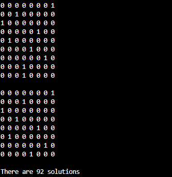
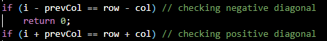
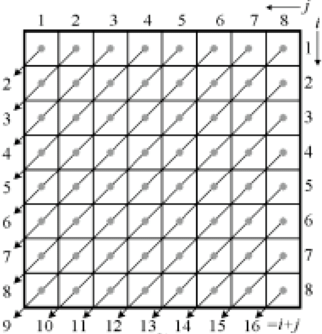
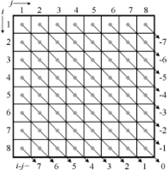

# 8 Queens Problem

## Project Overview

This project implements the **8 Queens Problem** in C++ using a backtracking algorithm. The goal is to place 8 queens on a chessboard such that no two queens threaten each other. This means:

- No two queens share the same row.
- No two queens share the same column.
- No two queens share the same diagonal (positive or negative).

The problem was initially studied by Carl Friedrich Gauss in 1850 and requires an iterative approach rather than a direct analytical solution.

## Key Features

- Generates **all 92 valid solutions**.
- Displays each solution as an **8x8 matrix** with:
  - **1** representing a queen.
  - **0** representing an empty position.
- Uses **efficient validation** to check placement of queens based on rows, columns, and diagonals.
- Outputs the **total number of solutions**.

## Platform and Tools

- **Programming Language:** C++
- **IDE:** Visual Studio Code
- **Compiler:** MinGW GCC/G++
- **Operating System:** Windows 11

## Installation and Setup

1. Clone the repository:
    [this is the repository url for the command below](https://github.com/NoLifeee/8-Queens-Problem)
   ```bash
    git clone <repository url>
   ```
    
2. Open the project folder in Visual Studio Code.
3. Ensure that a C++ compiler (such as MinGW) is installed.
4. Build and run the project:
   ```bash
   g++ 8queens.cpp -o 8queens
   ./8queens
   ```

## Usage Instructions

1. Execute the compiled program.
2. View the output displaying all **92 solutions**.
3. Each solution is presented in the form of an **8x8 matrix**.
4. At the end, the total count of solutions is displayed.

## Results

These are the last 2 solutions shown followed by the number of solutions



## Algorithm Logic

The implementation uses **backtracking** to attempt placing queens row by row:

1. Check each column in the current row.
2. Verify the position using:
- Row and column indices.
- Diagonal checks:
    - **Positive diagonals:** `row + col`
    - **Negative diagonals:** `row - col`
    Code for the diagonal checks:

    

- Visual representation of the diagonals:
    
    - **Positive diagonals:**
       

    - **Negative diagonals:**
    

3. Recursively attempt placement for the next row.
4. If no position is valid, backtrack and try the next column.

